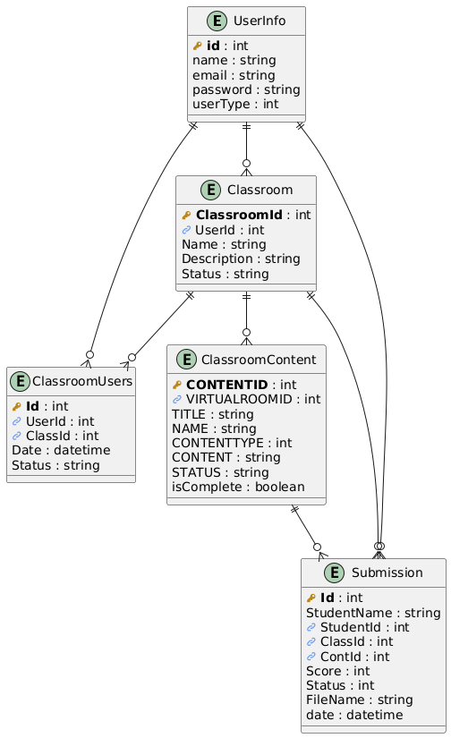

# E-Learning Platform

## Group 19 Members
- 25417 TUYISHIME Isaac(Leader)
- 25434 KALIZA GAJU Lauraine
- 25488 HIRWA Auguste
- 25515 TUYISHIME Elvis
- 25423 NAMAHORO Sandrine Marie Merci 
## Problem Statement
Many educational institutions struggle with inefficient digital learning experiences, lacking centralized course management, limited student-teacher interaction, and inadequate progress tracking mechanisms.

## Objective
Create a comprehensive online learning platform that:
- Provides seamless digital education experiences
- Enables efficient course management
- Facilitates effective student-teacher communication
- Supports comprehensive learning progress tracking

## Features
- User Authentication: Secure user login and registration
- Course Navigation: Intuitive interface for browsing and selecting virtual classrooms
- Interactive Learning: Engaging quizzes and assignments
- Progress Tracking: Detailed monitoring of course completion and achievements

## Use Case Diagram

## Database Diagram

## Technology Stack
- Backend: C# 
- Framework: ASP.NET Core
- Database: SQL Server
- Authentication: ASP.NET Core Identity
- ORM: Entity Framework Core

## Project Timeline

| Phase | Tasks | Duration |
|-------|-------|----------|
| Project Initialization | Requirements gathering, project setup | 1 days |
| Database Design | Schema creation, relationship mapping | 1 days |
| User Authentication | Identity implementation, login/register | 1 days |
| Core Functionality | Classroom creation, content management | 1 days |
| Assignment System | Submission, grading mechanism | 1 days |
| Testing | Unit testing, integration testing | 1 days |
| Deployment Preparation | Final adjustments, documentation | 1 days |

## Project Setup Instructions
1. Clone the repository
2. Install .NET Core SDK
3. Configure SQL Server connection
4. Run database migrations
5. Start the application

